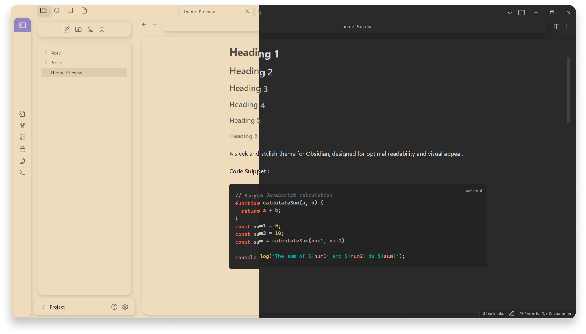

# Pale - 淡 Theme for Obsidian (Light and Dark Modes)

Enhance your Obsidian experience with the Pale Theme, offering both light and dark modes. This theme features a clean, elegant layout designed to provide a pleasant and visually appealing workspace.

## Light

## Dark 

## Installation 

- Open Settings 
- Go to the Appearance section.
- Click Manage next to Themes.
- Search for "Pale" and select "Install and use"

## Feedback

If you have any issues or suggestions, please  [submit an issue](https://github.com/Elhary/Pale---/issues) or raise a  [pull request](https://github.com/Elhary/Pale---/pulls).

